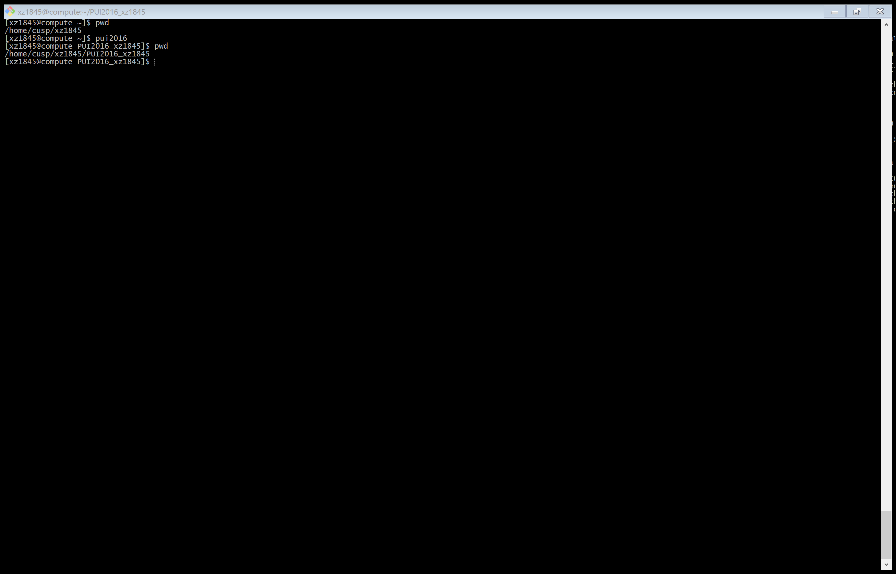

# PUI2016 HW1

# Xinshi Zheng

## Assignment 1:
See repository gittest_xz1845 for merging and forking history.

## Assignment 2:
An environment variable PUI2016 with an alias of pui2016 has been created for pointing to the directory PUI2016_xz1845 by its full directory path. The screenshot of .bashrc file can be found below:

The output of using the alias pui2016 can be found as following:

## Assignment 3:
See HW1_3_xz1845.ipynb for results. 
