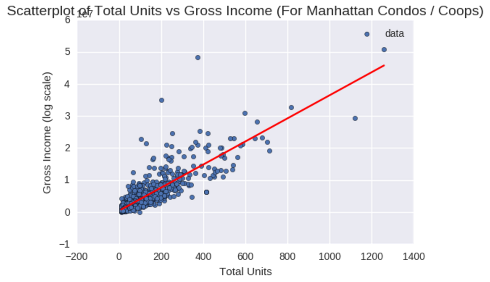
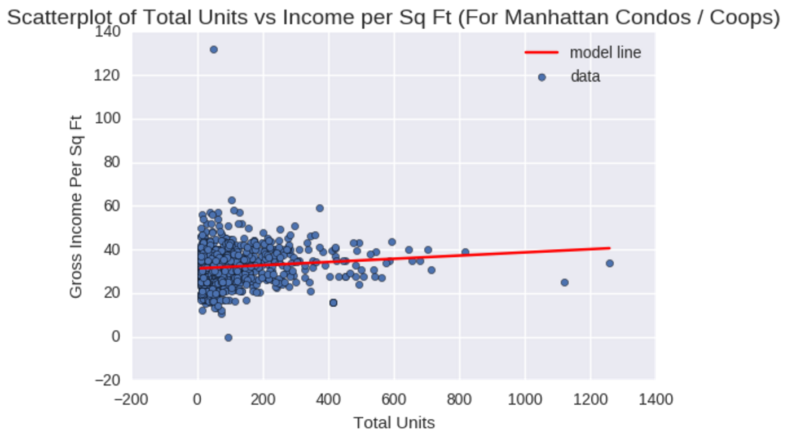

Both Plot 1 and 2 have clear title, axis labels. However, Plot 1 the legend is incomplete, as the trend line is not included on the upper left corner. Both plots have nice background rendered and plausible scales. There is a little overlapping in plot 1 between the title and the y axis on the upper left corner. Both plots are very helpful for demonstrating gtp232's arguments. In summary, the plots are well made with only miscellaneous errors.