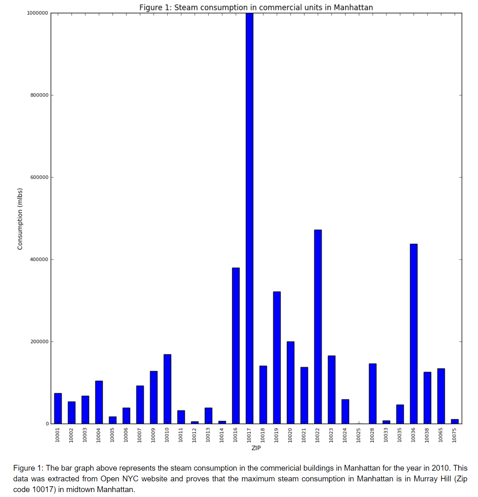

This bar plot shows the steam consumption in commercial buildings in Manhattan for 2010. The plot in general is clear and concise interms of the title, x and y labels. Hoever, the author may consider scale down the y axis since the plot is abit too high for the reader. Also, the maximum limit of y axis should be set to be slightly larger than the maximum value in the data for aethetical reason. In summary, the bar plot is a good method to visualize this type of data and it helps the author to demonstrate the argument.